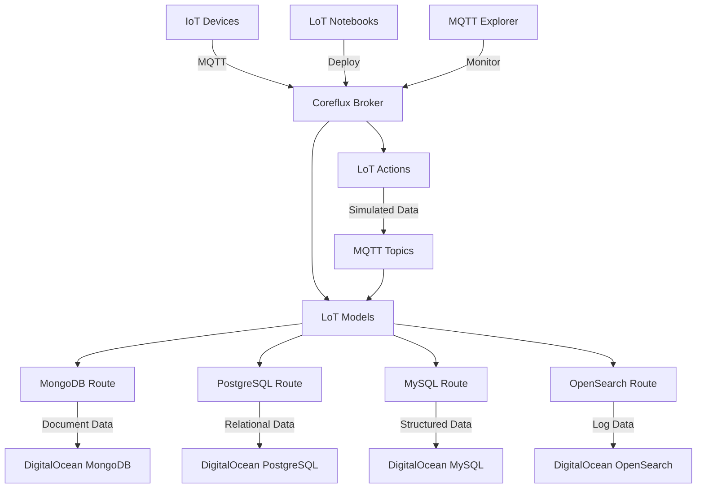

# Coreflux MQTT Broker with Multi-Database Integration on DigitalOcean

[](https://coreflux.org)
[](https://digitalocean.com)
[](https://mongodb.com)
[](https://postgresql.org)
[](https://mysql.com)
[](https://opensearch.org)
[](https://coreflux.org/docs)

Complete IoT automation pipeline using Coreflux MQTT broker with multi-database integration on DigitalOcean. This project demonstrates real-time data processing, transformation, and scalable storage across MongoDB, PostgreSQL, MySQL, and OpenSearch for diverse IoT applications.


## 🚀 Quick Start

This repository contains complete code examples and tutorials for deploying production-ready IoT automation systems with multiple database backends. Choose the database solution that best fits your use case or deploy multiple databases for comprehensive data management.

## 📓 Articles
- [Coreflux & MongoDB Article on DigitalOcean](www.google.com)
- [Coreflux & PostgreSQL Article on DigitalOcean](www.google.com)
- [Coreflux & MySQL Article on DigitalOcean](www.google.com)
- [Coreflux & OpenSearch Article on DigitalOcean](www.google.com)

### What You'll Build

- 🏗️ **Multi-database support** - MongoDB, PostgreSQL, MySQL, and OpenSearch
- 🖥️ **DigitalOcean droplet** running Coreflux MQTT broker
- 🔒 **VPC network** for secure IoT communication
- 📊 **Real-time data simulation** using Language of Things (LoT)
- 🔄 **Data transformation pipeline** with low-code Models and Actions
- 💾 **Flexible database integration** for diverse storage needs

## 📁 Repository Structure

```
├── notebooks/
│   ├── machine_data_mongodb.lotnb        # MongoDB integration tutorial
│   ├── machine_data_postgresql.lotnb     # PostgreSQL integration tutorial
│   ├── machine_data_mysql.lotnb          # MySQL integration tutorial
│   ├── machine_data_opensearch.lotnb     # OpenSearch integration tutorial
├── digitalocean_iot_examples.lotnb       # Introduction to Coreflux & DigitalOcean
├── docker-compose.yml                    # Local development setup for Coreflux Broker

```

## 🛠️ Prerequisites

Before you begin, ensure you have:

- **DigitalOcean Account** with billing enabled
- **Basic MQTT Knowledge** and IoT concepts understanding
- **Visual Studio Code** for LoT Notebooks extension
- **Database Client Tools** (optional) for data management

## ⚡ Quick Deploy

### 1. Infrastructure Setup

Create the foundational infrastructure on DigitalOcean:

- Create VPC
- Create prefered Managed Database
- Create Droplet with Coreflux Broker

### 2. Configure LoT Development Environment

1. Install [LoT Notebooks extension](https://marketplace.visualstudio.com/items?itemName=Coreflux.vscode-lot-notebooks) in VS Code
2. Connect to your MQTT broker:
   - **Host**: `your-droplet-ip`
   - **Username**: `root`
   - **Password**: `coreflux`
   - **TLS**: `No`

### 3. Choose Your Database Integration

Select the database tutorial that matches your use case:

| Database | Best For | Tutorial Notebook |
|----------|----------|-------------------|
| **MongoDB** | Document storage, flexible schemas, rapid prototyping | `machine_data_mongodb.lotnb` |
| **PostgreSQL** | Relational data, complex queries, ACID compliance | `machine_data_postgresql.lotnb` |
| **MySQL** | Traditional web apps, structured data, performance | `machine_data_mysql.lotnb` |
| **OpenSearch** | Log analysis, search, real-time analytics | `machine_data_opensearch.lotnb` |

## 📚 Database-Specific Tutorials

### MongoDB - Document-Based IoT Data
Perfect for flexible IoT schemas and rapid development:
- **Use Case**: Machine monitoring, sensor aggregation
- **Tutorial**: `notebooks/machine_data_mongodb.lotnb`
- **Features**: Schema flexibility, horizontal scaling, JSON-native

### PostgreSQL - Relational IoT Analytics  
Ideal for complex analytics and structured data:
- **Use Case**: Fleet management, financial IoT data
- **Tutorial**: `notebooks/machine_data_postgresql.lotnb`
- **Features**: ACID compliance, complex joins, time-series extensions

### MySQL - High-Performance IoT Storage
Optimized for high-throughput IoT applications:
- **Use Case**: E-commerce IoT, inventory tracking
- **Tutorial**: `notebooks/machine_data_mysql.lotnb`
- **Features**: Performance optimization, mature ecosystem

### OpenSearch - IoT Logs and Analytics
Specialized for search and real-time analytics:
- **Use Case**: Log aggregation, anomaly detection
- **Tutorial**: `notebooks/machine_data_opensearch.lotnb`
- **Features**: Full-text search, real-time dashboards, alerting

## 🏗️ Architecture Overview



## 📊 Monitoring & Analytics

### Database-Specific Monitoring

- **MongoDB**: Use MongoDB Compass for document exploration
- **PostgreSQL**: Connect with pgAdmin or DBeaver for query analysis  
- **MySQL**: Use MySQL Workbench or DBeaver for performance tuning
- **OpenSearch**: Access OpenSearch Dashboards for visualization

### MQTT Monitoring
- **MQTT Explorer**: Monitor live data flows across all databases

## 🌟 Acknowledgments

- **[Coreflux](https://coreflux.org)** for the powerful MQTT broker and LoT language
- **[DigitalOcean](https://digitalocean.com)** for comprehensive managed database services
- **Database Communities** for maintaining excellent open-source technologies
- **IoT Community Contributors** who help improve this project

## 🔗 Related Projects

- **[Coreflux Examples](https://github.com/CorefluxCommunity/LOT-Samples)** - Additional LoT code samples

-------


**Built with ❤️ by the IoT community** | **Powered by Coreflux & DigitalOcean**

Choose your database, deploy your IoT pipeline, and scale with confidence. Visit [Coreflux Documentation](https://docs.coreflux.org) for advanced tutorials and [DigitalOcean Documentation](https://docs.digitalocean.com/) for infrastructure and services guides.